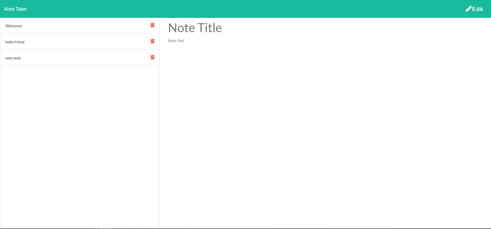

# Notes Application

[Repo: Notes Application](https://github.com/Jones-M12/Notes-Application-Jones)

[Deployed Site: Notes Application Jones](https://notes-application-jones.herokuapp.com/)

## Overview

This application was designed to allow a user to utilize an online notes application for writing, saving and deleting notes. 

It allows a user to move away from hand written notes that can be lost or easily damaged.

A user can better organize ideas without forgetting or being unable to recall.

## User Story

As a USER.

I WANT to be able to create notes, save them, and delete notes when they are no longer needed.

SO THAT I can organize and keep track of the progress for each task.

## Development 

I have designed the backend of this application using Express methods, designing it to take persistent notes that allow the user to recall information whenever neeeded.

I learned how to connect the frontend with the backend building routes and the server. I have gained more knowledge and increased my understanding of how the database, the server, and the client come together to build dynamic applications.

## Future Development: User Story

As a USER.

I WANT to be able to edit preexisting notes.

SO THAT I can organize and keep track of uncomepleted task.

## The following image demonstrates the application functionality:

## Contact Information

* Github: [Jones-M12](https://github.com/Jones-M12) 

* Email: malesharj@gmail.com 

* LindedIn: [m-jones89](https://www.linkedin.com/in/m-jones89/)

